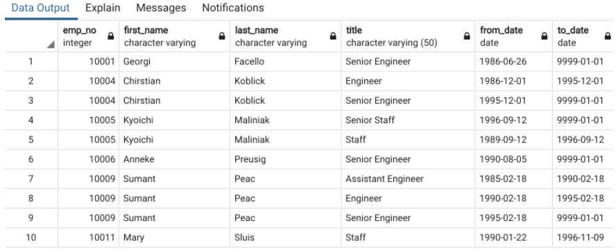
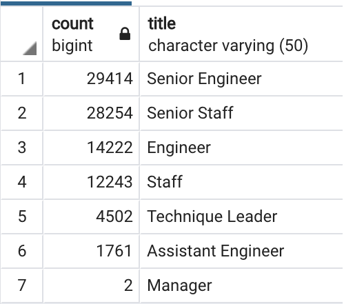

# Pewlett-Hackard-Analysis

# Summary
We were tasked within this assignment to work with the HR deparment in order to help figure out when the next wave of retirements would be.  At PH there is a large portion of the work population born during the Baby Boom era so within the next several years there will be a high number of employees retiring.  Using programs such as SQL and pgAdmin we were to examine the data provided by HR in order to pull out all the employees set for retirement.

#Results

* Listed below is one of the examples of the data we produced.  This shows a small portion of the table we created breaking down the PH employees born from 1952 through 1955.  This also shows their current title at PH.

* Next we were tasked to create a break down of the number of employees for each PH department.  The data shows that a vast majority of employees who are set to retire are Senior Engineers/Senior Staff totaling nearly 60,000 employees.

